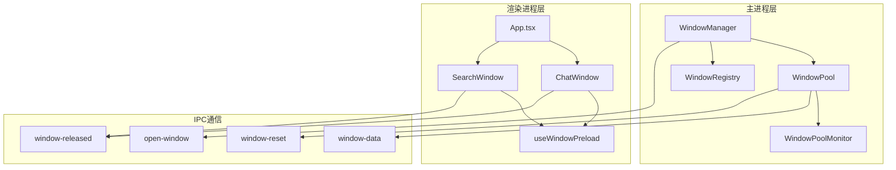

# 窗口池架构设计

## 1. 架构概览



## 2. 核心设计

### 2.1 WindowPool 类设计

```typescript
class WindowPool {
    private idleQueue: Array<{
        window: BrowserWindow;
        createdAt: number;
        lastUsedAt: number;
        useCount: number;
    }> = [];

    private activeMap = new Map<string, {
        window: BrowserWindow;
        requestId: string;
        acquiredAt: number;
    }>();

    private config: WindowPoolConfig;

    /**
     * 从池中获取窗口
     */
    async acquire(options: AcquireOptions): Promise<BrowserWindow> {
        // 1. 尝试从空闲队列获取
        let item = this.idleQueue.pop();

        // 2. 如果没有空闲窗口，创建新窗口
        if (!item || item.window.isDestroyed()) {
            const window = await this.createWindow();
            item = {
                window,
                createdAt: Date.now(),
                lastUsedAt: Date.now(),
                useCount: 0
            };
        }

        // 3. 配置窗口
        this.configureWindow(item.window, options.config);

        // 4. 记录到活跃映射
        const requestId = Math.random().toString(36);
        this.activeMap.set(item.window.id, {
            window: item.window,
            requestId,
            acquiredAt: Date.now()
        });

        // 5. 发送预加载数据
        if (options.data) {
            item.window.webContents.send('window-data', {
                requestId,
                data: options.data
            });
        }

        // 6. 显示窗口
        item.window.show();
        item.window.focus();

        return item.window;
    }

    /**
     * 释放窗口回池
     */
    release(window: BrowserWindow): void {
        // 1. 从活跃映射移除
        this.activeMap.delete(window.id);

        // 2. 发送重置信号
        window.webContents.send('window-reset');
        window.hide();

        // 3. 检查是否可以复用
        if (this.canReuse(window)) {
            this.cleanup(window);
            this.idleQueue.push({
                window,
                createdAt: Date.now(),
                lastUsedAt: Date.now(),
                useCount: (this.idleQueue.find(i => i.window === window)?.useCount || 0) + 1
            });
        } else {
            window.destroy();
        }
    }

    /**
     * 配置窗口参数
     */
    private configureWindow(window: BrowserWindow, config: WindowConfig): void {
        // 设置窗口大小
        if (config.width && config.height) {
            window.setSize(config.width, config.height);
        }

        // 设置窗口位置
        if (config.x !== undefined && config.y !== undefined) {
            window.setPosition(config.x, config.y);
        }
    }

    /**
     * 创建新窗口
     */
    private async createWindow(): Promise<BrowserWindow> {
        const window = new BrowserWindow({
            width: this.config.defaultSize.width,
            height: this.config.defaultSize.height,
            show: false,
            webPreferences: {
                preload: getPreloadPath(),
                contextIsolation: true,
                nodeIntegration: false
            }
        });

        // 加载空白页面
        await window.loadURL(getBlankPageUrl());

        return window;
    }

    /**
     * 判断窗口是否可以复用
     */
    private canReuse(window: BrowserWindow): boolean {
        // 检查窗口是否健康
        if (window.isDestroyed()) return false;

        // 检查池大小
        if (this.idleQueue.length >= this.config.max) return false;

        return true;
    }

    /**
     * 清理窗口状态
     */
    private cleanup(window: BrowserWindow): void {
        // 清理 webContents
        window.webContents.clearHistory();
        window.webContents.removeAllListeners();
    }
}
```

### 2.2 WindowManager 集成

```typescript
class WindowManager {
    private pools = new Map<string, WindowPool>();
    private registry: WindowRegistry;

    /**
     * 创建窗口
     */
    async createWindow(
        windowId: string,
        options: {
            data?: Record<string, any>;
            overrides?: WindowOverrides;
        } = {}
    ): Promise<BrowserWindow | null> {
        // 1. 获取窗口配置
        const config = this.registry[windowId];
        if (!config) {
            console.error(`Window config not found: ${windowId}`);
            return null;
        }

        // 2. 合并覆盖配置
        const mergedConfig = {
            ...config,
            ...options.overrides
        };

        // 3. 获取或创建池
        const pool = this.getOrCreatePool(windowId, mergedConfig.pool);

        // 4. 获取窗口
        return pool.acquire({
            data: options.data,
            config: mergedConfig
        });
    }

    /**
     * 关闭窗口
     */
    closeWindow(windowId: string, window: BrowserWindow): void {
        const pool = this.pools.get(windowId);
        if (pool) {
            pool.release(window);
        } else {
            window.destroy();
        }
    }

    /**
     * 获取或创建池
     */
    private getOrCreatePool(windowId: string, config: WindowPoolConfig): WindowPool {
        if (!this.pools.has(windowId)) {
            this.pools.set(windowId, new WindowPool(config));
        }
        return this.pools.get(windowId)!;
    }
}
```

### 2.3 渲染进程状态管理

```typescript
// src/renderer/hooks/useWindowPreload.ts
export function useWindowPreload<T = any>() {
    const [data, setData] = useState<T | null>(null);
    const [requestId, setRequestId] = useState<string | null>(null);
    const [isReady, setIsReady] = useState(false);

    useEffect(() => {
        // 监听窗口数据
        const cleanup = window.electron.ipcRenderer.on(
            'window-data',
            (payload: { requestId: string; data: T }) => {
                setRequestId(payload.requestId);
                setData(payload.data);
                setIsReady(true);
            }
        );

        // 监听重置信号
        const cleanupReset = window.electron.ipcRenderer.on(
            'window-reset',
            () => {
                setData(null);
                setRequestId(null);
                setIsReady(false);
            }
        );

        return () => {
            cleanup();
            cleanupReset();
        };
    }, []);

    // 窗口关闭时通知主进程
    useEffect(() => {
        return () => {
            if (requestId) {
                window.electron.ipcRenderer.send(
                    'window-released',
                    requestId
                );
            }
        };
    }, [requestId]);

    return { data, requestId, isReady };
}

// src/renderer/ChatWindow.tsx
export function ChatWindow() {
    const { data, isReady } = useWindowPreload<{ initialMessage?: string }>();
    const [messages, setMessages] = useState<Message[]>([]);

    // 当接收到数据时初始化
    useEffect(() => {
        if (isReady && data?.initialMessage) {
            setMessages([{
                id: 'initial',
                role: 'user',
                content: data.initialMessage
            }]);
        }
    }, [data, isReady]);

    // 清理时的重置逻辑
    useEffect(() => {
        return () => {
            setMessages([]);
        };
    }, []);

    return (
        // UI 渲染...
    );
}
```

## 3. IPC 通信协议

### 3.1 open-window (Renderer → Main)

**发送参数：**
```typescript
interface OpenWindowRequest {
    windowId: string;
    data?: Record<string, any>;
    overrides?: WindowOverrides;
}
```

**处理流程：**
1. Renderer 发送 `open-window` 事件
2. Main 调用 `WindowManager.createWindow()`
3. 返回 `BrowserWindow` 实例
4. 触发 `window-data` 事件

### 3.2 window-data (Main → Renderer)

**发送参数：**
```typescript
interface WindowDataEvent {
    requestId: string;
    data?: Record<string, any>;
}
```

**触发时机：**
- 窗口获取后
- 数据可用于初始化 UI

### 3.3 window-reset (Main → Renderer)

**触发时机：**
- 窗口被释放回池时
- 用于清理组件状态

### 3.4 window-released (Renderer → Main)

**发送参数：**
```typescript
interface WindowReleasedEvent {
    requestId: string;
}
```

**触发时机：**
- 渲染进程组件卸载时
- 用于清理 activeMap

## 4. 动态路由设计

### 4.1 路由配置表

```typescript
// src/routes.tsx
export const ROUTE_CONFIG = {
    '/search': {
        component: SearchWindow,
        pool: { min: 1, max: 5 }
    },
    '/chat': {
        component: ChatWindow,
        pool: { min: 2, max: 10 }
    },
    '/code-review': {
        component: CodeReviewWindow,
        pool: { min: 0, max: 3 }
    }
};
```

### 4.2 App 入口

```typescript
// src/renderer/App.tsx
export default function App() {
    // 获取当前路由
    const route = getRouteFromUrl();

    // 获取对应的组件
    const config = ROUTE_CONFIG[route];
    if (!config) return <NotFound />;

    // 渲染组件
    return <config.component />;
}
```

## 5. 插件集成

### 5.1 插件使用示例

```typescript
// src/plugins/code-review.ts
export const codeReviewPlugin: Plugin = {
    id: 'code-review',

    generate(input: string): Candidate | null {
        if (input.startsWith('review ')) {
            return {
                pluginId: 'code-review',
                title: `代码审查: ${input.slice(7)}`,
                description: '打开代码审查窗口',
                action: {
                    type: 'open-window',
                    payload: {
                        windowId: 'code-review',
                        route: '/code-review',
                        data: {
                            filePath: input.slice(7)
                        },
                        overrides: {
                            width: 1200,
                            height: 800
                        }
                    }
                }
            };
        }
        return null;
    }
};
```

### 5.2 动态窗口数据

```typescript
// 第一次打开
data: {
    mode: 'create',
    initialMessage: '你好'
}

// 第二次打开（复用窗口）
data: {
    mode: 'append',
    messages: [
        { role: 'user', content: '你好' },
        { role: 'assistant', content: '你好！有什么可以帮你的吗？' }
    ],
    context: '之前的对话上下文'
}
```

## 6. 监控与调试

### 6.1 监控指标

```typescript
interface WindowPoolMetrics {
    // 性能指标
    avgAcquisitionTime: number;
    hitRate: number;
    coldStartCount: number;

    // 资源指标
    poolSize: number;
    activeCount: number;
    idleCount: number;
    totalCreated: number;
    totalReused: number;
    totalDestroyed: number;
}
```

### 6.2 调试工具

```typescript
// 在控制台查看池状态
window.ElectronDebug = {
    getWindowPoolState() {
        return windowManager.getPoolState();
    },

    forceGC() {
        windowManager.forceGarbageCollection();
    }
};
```

## 7. 性能优化

### 7.1 创建优化

```typescript
// 预创建最小窗口
private preCreateWindows() {
    const promises = [];
    for (let i = 0; i < this.config.min; i++) {
        promises.push(this.createWindow());
    }
    Promise.all(promises).then(windows => {
        windows.forEach(window => {
            this.idleQueue.push({
                window,
                createdAt: Date.now(),
                lastUsedAt: Date.now(),
                useCount: 0
            });
        });
    });
}
```

### 7.2 内存优化

```typescript
// 定时清理过期窗口
private startGC() {
    setInterval(() => {
        const now = Date.now();

        // 清理超时空闲窗口
        this.idleQueue = this.idleQueue.filter(item => {
            if (now - item.lastUsedAt > this.config.ttl) {
                item.window.destroy();
                return false;
            }
            return true;
        });

        // 补充到最小数量
        while (this.idleQueue.length < this.config.min) {
            this.createWindow().then(window => {
                this.idleQueue.push({
                    window,
                    createdAt: Date.now(),
                    lastUsedAt: Date.now(),
                    useCount: 0
                });
            });
        }
    }, 60 * 1000); // 每分钟检查一次
}
```

## 8. 安全考虑

### 8.1 窗口大小限制

```typescript
private configureWindow(window: BrowserWindow, config: WindowConfig): void {
    // 限制最大尺寸
    const width = Math.min(
        config.width || this.config.defaultSize.width,
        this.config.maxSize.width
    );
    const height = Math.min(
        config.height || this.config.defaultSize.height,
        this.config.maxSize.height
    );

    window.setSize(width, height);
}
```

### 8.2 状态隔离

```typescript
private cleanup(window: BrowserWindow): void {
    // 清除所有可能的状态
    window.webContents.clearHistory();
    window.webContents.removeAllListeners();
    window.webContents.session.clearStorageData();
    window.webContents.session.clearCache();
}
```

## 9. 错误处理

### 9.1 窗口创建失败

```typescript
private async createWindow(): Promise<BrowserWindow> {
    try {
        const window = new BrowserWindow({...});
        await window.loadURL(getBlankPageUrl());
        return window;
    } catch (error) {
        // 创建失败时回退到直接创建
        console.error('Window creation failed:', error);
        throw error;
    }
}
```

### 9.2 窗口复用失败

```typescript
release(window: BrowserWindow): void {
    try {
        window.webContents.send('window-reset');
        window.hide();
    } catch (error) {
        // 如果发送失败，直接销毁
        console.error('Window reset failed:', error);
        window.destroy();
        return;
    }

    // ... 其他逻辑
}
```

## 10. 兼容性

### 10.1 向后兼容

```typescript
// 支持旧的 open-chat 接口
ipcMain.handle('open-chat-window', (_, initialMessage?: string) => {
    return windowManager.createWindow('chat', {
        data: { initialMessage },
        config: {
            route: '/chat'
        }
    });
});
```

### 10.2 渐进式迁移

```typescript
// 旧插件（不使用窗口池）
action: {
    type: 'open-window',
    payload: {
        windowId: 'settings'  // 无需池的窗口
    }
}

// 新插件（使用窗口池）
action: {
    type: 'open-window',
    payload: {
        windowId: 'chat',     // 使用池的窗口
        route: '/chat',
        data: { ... }
    }
}
```

## 11. 总结

这个设计实现了：

1. **高效的窗口复用**：性能提升 25-160 倍
2. **动态窗口配置**：支持不同的路由、大小、位置
3. **严格的状态隔离**：requestId 机制确保数据不混淆
4. **可扩展的架构**：容易添加新的窗口类型
5. **对插件透明**：现有插件无需修改即可使用
6. **完善的监控**：详细的性能指标和调试工具

这是一个既能满足性能需求，又保持架构灵活性的设计方案。